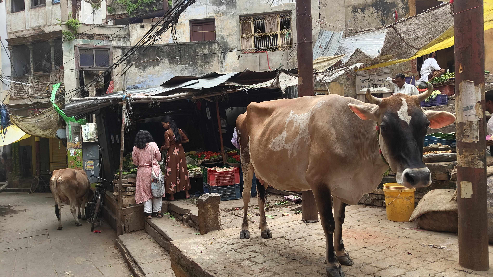
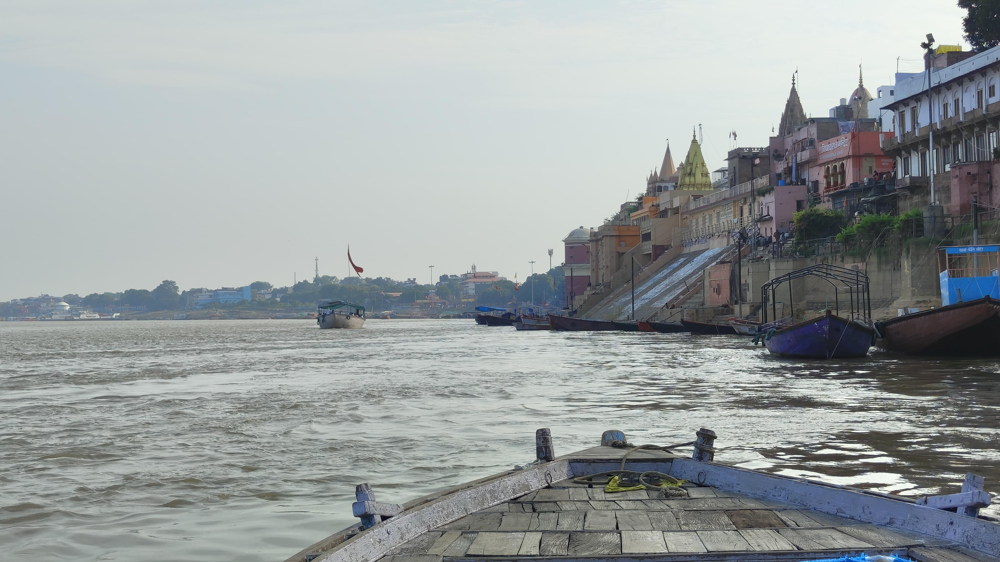
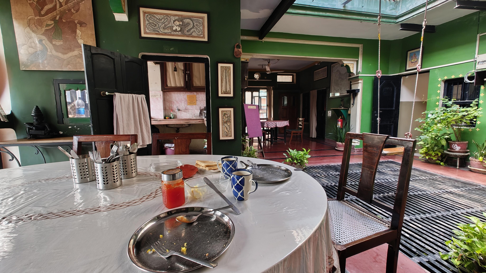
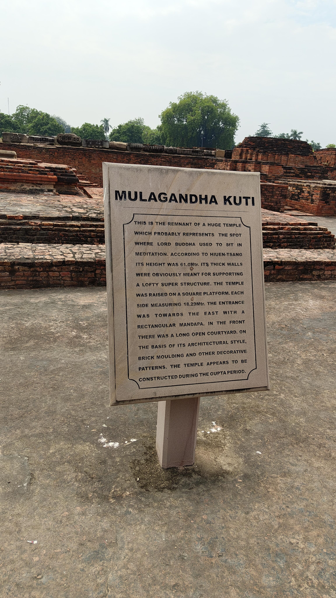
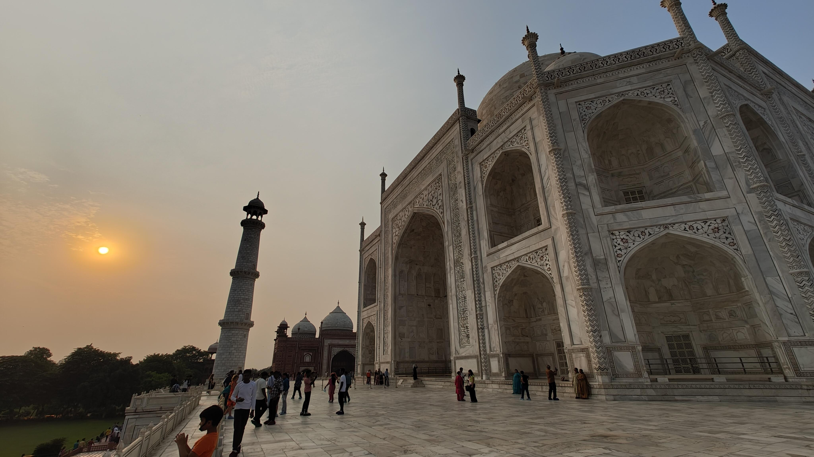

- これはサマホリと移動日休暇を使ってインド、もとい Bharat に行った記録です。
- おもしろいかはさておき、記憶が風化しないように、覚えていることはほぼすべてだらだら書いたので非常に長いです。
  - 1人で行って誰にも共有できないのは悲しいしもったいないので…
- すべて余暇の時間で書いています。

- [プロローグ](#プロローグ)
- [1日目：デリーまで移動](#1日目デリーまで移動)
	- [ハノイをうろうろした話](#ハノイをうろうろした話)
	- [インドに着いてさっそく詐欺られた話](#インドに着いてさっそく詐欺られた話)
- [2日目：バラナシでの Babu さんとの出会い](#2日目バラナシでの-babu-さんとの出会い)
	- [飛行機でバラナシに移動した話](#飛行機でバラナシに移動した話)
	- [ガンジス川でボートに乗った話](#ガンジス川でボートに乗った話)
	- [メロスの気持ちがわかった話](#メロスの気持ちがわかった話)
- [3日目：友達との出会いと火葬場での事件](#3日目友達との出会いと火葬場での事件)
	- [スペイン人物理学者と出会った話](#スペイン人物理学者と出会った話)
	- [バラナシの火葬場で詐欺られた話](#バラナシの火葬場で詐欺られた話)
	- [詐欺から逃げた話](#詐欺から逃げた話)
	- [ラッシー食べて Sergio とカレーを食べた話](#ラッシー食べて-sergio-とカレーを食べた話)
- [4日目：朝日を見て友達とお別れ](#4日目朝日を見て友達とお別れ)
	- [再びボートに乗って朝日を拝んだ話](#再びボートに乗って朝日を拝んだ話)
	- [Sergio と Sarnath に行った話](#sergio-と-sarnath-に行った話)
	- [デリーのホテルまで移動した話](#デリーのホテルまで移動した話)
- [5日目：タージマハルとまた事件](#5日目タージマハルとまた事件)
	- [ニザムディン駅から鉄道でアグラに向かった話](#ニザムディン駅から鉄道でアグラに向かった話)
	- [良さげなリキシャドライバーに出会った話](#良さげなリキシャドライバーに出会った話)
	- [アグラ観光をした話](#アグラ観光をした話)
	- [高いお土産を買ってしまった話](#高いお土産を買ってしまった話)
	- [タージマハルを見て感動した話](#タージマハルを見て感動した話)
- [6日目：デリーでまたまた事件](#6日目デリーでまたまた事件)
	- [アグラ駅で Shabbu さんに再会した話](#アグラ駅で-shabbu-さんに再会した話)
	- [インドの鉄道で衝撃を受けた話](#インドの鉄道で衝撃を受けた話)
	- [デリー観光をした話](#デリー観光をした話)
	- [黒ターバン男にぼったくられそうになった話](#黒ターバン男にぼったくられそうになった話)
- [7日目：ハノイでの暇つぶし](#7日目ハノイでの暇つぶし)
	- [ホーチミン廟に行ってバインミーを食べた話](#ホーチミン廟に行ってバインミーを食べた話)
	- [ハノイをうろついたけど退屈していた話](#ハノイをうろついたけど退屈していた話)
- [エピローグ](#エピローグ)

# プロローグ

インドに行きたい理由はいろいろありました。

- 東南アジアを中心にいろいろ旅行したことはあったけど、もっと刺激が欲しかった
- 旅行難易度が高いとされる国を、自分は無事に渡り歩けるのか？試したかった
- 仏教の影響を受けている日本人として、1回は見ておくべきだと思った
- 行くなら若いうちのほうがいいと思った
- 人口が最大になった国の現状を、いま見ておくべきと思った

それぞれの理由は浅いですが、積み重なった結果、せっかくサマホリを使うならインドという国に行ってみようという感じでした。

関西国際空港—デリー空港間の往復券を調べてみると、土日を避ければ10月で5万8千円だったので、とりあえず買ってしまいました。

そこからは早かったです。

僕はお腹が弱いので、辛いものを食べて慣らしたり、数か月前から整腸剤を飲み続けたりしました。

調べて e-VISA を申し込んだり、いちおういくつかワクチンも受けたりしました（A 型肝炎、 B 型肝炎、破傷風、狂犬病）。

ワクチン代は高かったですが、福利厚生のポイントでけっこういいレートで全額返ってきました。

デリーだけだと退屈すると思い、追加でデリー—バラナシ間の国内線も予約しました。

せっかくインドに行くならあのタージマハルも見てみたいので、デリー—アグラ間の鉄道も予約しました（e-VISA もそうですがサイトが非常に使いにくかった…）。

過去の経験から、現地語は何となく読めていたほうが絶対楽しいというのはわかっていたので、ヒンディー語をかじり始めました。

インドに行ったことがある友達に「デビットカードがあったほうが絶対いい」と言われたので、デビットカードを作りました。

ここまでの移動の予定はこんな感じ。

- 大阪→ハノイ（ベトナム）→デリー
- デリー→バラナシ
- バラナシ→デリー
- デリー→アグラ（鉄道）
- アグラ→デリー（鉄道）
- デリー→ハノイ→大阪

10月のある日、退勤後、そのまま空港近くのゲストハウスにチェックインしました。

Nintendo Alarmo がちょうど発表されていたので、それを見ながらコンビニ弁当を食べました。

100年前に建ったという日本家屋をリノベーションしたゲストハウスで、アンティークでとてもよかったです。

それでいて清潔で快適でした。おっちゃんもとってもいい人でした。

最後の日本らしい「和」を感じました。

[ゲストハウス&ランチ喜平](https://maps.app.goo.gl/hpby8qeGMJ1dCnfM9)

翌朝、おっちゃんとは会えず、鍵を置いて空港に向かいました。

気持ちのいい快晴でした。

# 1日目：デリーまで移動

## ハノイをうろうろした話

ハノイに着いたのは現地時間の 12 時過ぎくらいでした。

ハノイ→デリーの飛行機は 19 時くらいだったので、それまでハノイ市街を観光することにしました。

1年前のサマホリでベトナム旅行をしていたので、ハノイは 2 回目でした。

入国し、さっそくデビットカードでお金をおろしてみようとしました。

しかしパスコードが違うとかのエラーで出金できない…2台目もダメ。

3台目でようやくお金が出ました。どうやらカードと ATM との相性問題があるようです。

始まりから早々に焦りました。

Grab（東南アジアでよく使われる配車アプリ）で市内行きのタクシーを予約しましたが、クレジットカードを新しくしたせいで情報が飛んでいたようです。

新しくクレカ情報を登録しようとしたけど、二段階認証のコードが届かないせいでできない。

結局、ベトナムの移動手段は現金でやりくりすることにしました。

（povo 2.0 の海外プランを申し込んだら SMS も届くんでは？と思ったけど、焦って「シンガポール・マレーシア」のトッピングを無駄に購入してしまった…しかも新たに「タイ・ベトナム」を購入するには前のトッピングを使い切らなければならず、使い切れることはないため試すこともできませんでした）

ハノイの市街地に着いて、うろうろして「去年来たときと変わらんな～」とか思ったりしてました。

朝から何も食べてなかったのでフォーを食べたりしました。

[Bún Chả Que Tre](https://maps.app.goo.gl/ydHbyPJBpM3imDqx8)

空港までのタクシー代が（現金で）なかったので、また ATM でお金をおろすことに。

いろいろ探し回って、お金が出る「当たり」のATMをやっと発見しました。

なんやかんやもう空港に行ったほうがいい時間になったので、 Grab でタクシーを呼んで向かいました。

空港でフランスの証券会社で働いてるというケニア出身の人に話しかけられました（脈絡はないけど思い出のため書いておく）。

デリー行きの飛行機に乗るためのチェックインカウンターには、すでにインド人らしい人たちがたくさん並んでいました。この時点でインドを感じました。

チェックインしようとすると「あなたの予約が見つからないから、あっちの Viet Jet Air の窓口に行ってみてほしい」と言われました。

どうやらベトナムに入国するとは想定されていなかったらしい？

印刷された紙をもって再びカウンターに行くと、無事チェックインできました。よかった。

コンコース内のトイレで歯を磨いたりした後、飛行機に乗りました。

## インドに着いてさっそく詐欺られた話

デリーに着いたのはインド時間の 23 時ごろ。

そこかしこにヒンディー語が書かれてありテンションがあがります。

入国審査時には指紋を登録するみたいですが、機械に左手を置いても、入国審査官のおじさんが「ノー」というように首を横に振ります。

どうやら機械の精度が悪く、正しく読み取れていないらしい。

「服で手を拭いてくれ」とジェスチャーで示され試すも、また顔を横に振り、ダメだったらしいです。

手の消毒液を差し出され、それをつけて左手をかざすと、おじさんは深くうなずきました。

オッケーらしい。

いけるんかい！　と笑ってしまいました。

次は右手なので、「じゃあ消毒液ください」と右手をだすと、いかつかったおじさんも笑いました。

緊張からのほっこり＆記憶に残っているエピソードなので書いておきました。

入国でき、 ATM でお金も無事に下ろせたので空港の外に出ました。

YouTube で見てた場所だー！　タクシー運転手たちがしつこく声をかけてきますが、「インドは5回目です」とか適当に嘘をついてかわします。

Uber でタクシーを呼びました。インドの空港には “APP BASED TAXI” が停まるためのエリアが別であるんですね（シアトルもそうだったかも）。

呼んだタクシーに乗りましたが、運転手のおじさんは現金しか受け付けないと言います。

Uber でもクレカ情報飛んでたか？

じゃあ現金で払うから、着いたらこの trip はキャンセルするね、ということで了承しました。

ホテルはこの路地の中だからと、大通りで降ろされました。

₹460 くらいを現金で支払いました。

（1 INR = 1.78 JPY くらいだったので、2倍弱を計算すれば日本円になる）

路地の入口では、若い男たちがこちらをニヤニヤ見てきて怖かったです。

路地は暗く、曲がり角には野犬がいる…

狂犬病ワクチンを受けましたが、もし噛まれたら咬傷後のワクチン接種も必要で、面倒なことになります。

それにもし車の影に人がいて、突然襲われたりしたらどうしよう。

僕は曲がり角にいる犬と目を合わせないように、下を向きました。

すると目に入ったのは、何かの大きい糞、何かに噛まれた跡があるネズミの死骸…

この時点でとんでもないところに来てしまったと、若干パニックでした。

ホテルに行くには犬がいる角を曲がらなければいけません。

僕は現地人ですというように犬のそばを通ると、突然犬が吠えかかってきました！

とっさにかわし、犬と対峙すると、そいつはそれ以上は近づいてきませんでした。

本当に危なかった。

遠くの（おそらく僕の後ろ側の交差点にいる）犬が吠え返して応答しています。

犬同士が会話しているようでした。

逃げ込むようにホテルに入ります。

[Hotel Pearl Mahipalpur Delhi Airport](https://maps.app.goo.gl/F11qsXZHNuy3HDzV8)

チェックインを済ませ（支払いは現金だった。インドはクレジットカード決済が普及していないらしい？）、何か食べるかと言われたので、チキンサンドイッチとオレンジジュースを頼みました。

また、翌朝の空港までのタクシーはいるかと言われたので、 06:30 で予約しておきました。

部屋に入ると、安いビジホのような感じでした。

変な音の呼び鈴が鳴って、食事を受け取りました（オレンジジュースがグアバジュースになってた）。

インドに来て初めての食事です。

どうか衛生的に調理されたものでありますようにと考えながら食べました。

Uber の支払い完了の通知が来ました。

すっかり Uber の trip をキャンセルするのを忘れていた。

先ほど現金で払っていたので、オンラインでも払ってしまい、二重に支払ってしまったことになります。

Uber を使っていても、こんな詐欺の手口があるのか…超悔しかった。

シャワーを浴びて、この日はふて寝しました。

# 2日目：バラナシでの Babu さんとの出会い

## 飛行機でバラナシに移動した話

翌朝モーニングコールで起こされたのは6時32分。

前日はハノイで歩き回ったうえ、時差による長い1日のせいで想像以上に疲れていたのです。

すぐに行くと伝えて、顔を洗って部屋を飛び出しました。

フロントに行くとタクシーが待っていたので、昨晩のサンドイッチ代を支払ってから乗りました。

タクシーの汚い車窓から見た、建設途中のビルの合間からのぞく赤く丸い朝日が、とても美しかったのを覚えています。

空港に着きましたが、入るにはパスポートだけでなく飛行機のチケットも必要みたいです。

チケットなんて持ってないよ！と焦りましたが、この機械に予約番号を入れれば印刷してくれました。

バラナシ行きの飛行機は 10:40 発。

インドの交通状況が読めなかったので早めにホテルを出ましたが、早く着きすぎました。

とりあえずフードコートでカレーを食べました。

その後はターミナルの端から端まで行ったり来たりして、ほぼインド人しかいない独特の雰囲気を味わいました。

（Chole bhature というセットを頼みました。インド北西部の Panjab 地方で食べられる朝食らしい。₹585.65 もした）

Diwali（インドの国民的祝祭）が近かったので展示物の用意もありました。

ほんとは Diwali も見たかったけど、航空券が安くなるのを優先してはずした計画を立てました。

バラナシに到着したのは 12 時すぎ。

Uber タクシーで中心部のホテルに向かいました。

クラクション連発の、荒い運転に揉まれながら外を見ると、「あぁ俺いまインドにいるんだなぁ…」と思わされます。

「ここから先、車は通れないから」と中心地の入口で降ろされました。

細い路地には、本当に野生の猿や牛もいました。

ホテルについて、チェックインしました。

近辺より少し高めですが、クーラーも付いていて、伝統的な素敵な建物に泊まれました。

[Ram Bhawan Residency](https://maps.app.goo.gl/PEhyNRmH5RM2Jthu7)

## ガンジス川でボートに乗った話

荷物を置いたらさっそくガンジス川を見に行きます。

牛の糞にたかるハエで霧のようになっている細い路地を進んでいきます。

途中、若い男に「ガンジス川クルーズに行かないか」と声をかけられるものの、₹3000 とのことだったので、とりあえず「あとで考える」と断りました。

突然視界がひらけ、ついにガンジス川とご対面しました。

川も空も広く、おそらく粉塵と排気ガスで霞んでいるものの、何キロも先まで見えます。

川の流れは穏やかで静かでした。

下を見ると本当に沐浴している人がいます。

特に臭いもなく、僕が入っても受け入れてくれるんじゃないかと思ったほど雄大でした。

ガンジス川（The Ganges）は現地のヒンディー語で गंगा（ガンガー）と呼ばれています。

ヒンドゥー教徒にとっていわゆる聖地であり、多くの巡礼者が訪れます。

川での沐浴は罪を清めると信じられており、また自分の遺灰を流すことで「輪廻」をスキップして「涅槃」に至る（解脱）とされています。

ここバラナシ（वाराणसी, Varanasi）には「火葬場のために存在する町」として、大小2つの火葬場があります。

ヒマラヤ山脈からベンガル湾までの全長約 2524 km の大河であり、流域人口はインド人口の約4割、 4 億 9 千人とされています（https://www.nilim.go.jp/lab/bcg/siryou/tnn/tnn0263pdf/ks0263033.pdf）。

つまり世界の 16 人に約 1 人はガンジス川に頼って生活していることになります（世界人口を 81億1900万人 とした場合）。

しかし遺灰だけでなく、生活下水や工業排水も流されているため、水質汚染が深刻な問題となっています。

ガンジス川沿いを歩いてボーっとチルい気分に浸ろうと思ったのですが、この季節は水量が多くて川岸は歩けないみたいです。

バラナシの町をぐるっと回って、別のガートに行くことにしました。

घाट（ghat, ガート）というのは「川に降りるための階段状の施設」くらいの意味らしいです。

バックパッカーの間で有名な Bunny Cafe や「久美子の家」（意外と汚いらしい）があるところのガートを降りました。

この細い道？を犬に阻まれながら進むと、シャツ姿のおじさんにボートはいかがかと声をかけられました。

₹1000 だが、モーター付きのボードで、乗客はあなただけ、観光には時間もベストだし、ゆっくりちゃんとガイドしてあげると言われました。

先ほど路地で若者に ₹3000 と言われていたし、日本円だと 2000 円弱くらいだいしいいかと思ってお願いしました。

（観光客向けには ₹300 くらいのボートもあるのですが、大人数だし速くてすぐ終わるらしい）

ボートに乗り、いざ出航（女性の場合、1人で乗ると危険らしいので気をつけてください）。

彼は名を बाबू (Babu) といい、稼ぎは少ないが 2 人の娘と 1 人の息子には良い教育を受けさせるように努力しているとのこと。

ボートは Raja Ghat というガートから出発して南下して行きます。

[ラージャー・ガート](https://maps.app.goo.gl/cdL1q2JXTXMKF9uXA)

ガンジス川から見ると色とりどりの建物や並び、沐浴をする人や商売をする人で、どこも活気に満ちていました。

火葬場からの煙の臭いが感じられました。

Babu さんには、古い寺院や城、イスラムのモスクなどを丁寧にガイドしていただきました。

川沿いに水道局があって、ここでガンジス川から水をろ過してバラナシの町をまかなっている、という話が印象的でした。

このガンジス川には Varuna River (वरुणा) と Assi River (अस्सी) という2つの支川が交わることから、2つを合わせて Varanasi **(**वाराणसी) という地名が生まれたということも教えてくれました。

その2つの川は今は地中を通っているから見れないらしい。

ボートは Raja Ghat から南下して、小さい方の火葬場を通って、バラナシの南端にある Assi Ghat に到達しました。

「これから Raja Ghat に戻るけど、それより北側を見たいならもう ₹1500 払ってほしい。でも私は日本人が好きで、君はいいやつだから ₹1000 でいい」と言いました。

せっかくなのでお願いしたかったけど、持ち合わせの現金がありませんでした。

そう伝えると、「お金なんて後でいい。俺はお前を信じている」と言ってくれました。

帰りはボートのエンジンを止めてくれて、ゆったり帰りました。

「馴れ馴れしく声をかけてくる人は基本詐欺師」

「偽の観光案内所に連れて行かれて高額なツアーに申し込まれる」

そういったインドの悪い噂は知っていたものの、こういういい人にはちゃんと高いお金を払うべきだと思いました。

（相場からするとたしかに高いが、長いボート上での滞在時間や自分だけにガイドしてくれるというサービスを考えると割にあっていた）

Raja Ghat の北側も見て、大きい方の火葬場を見たりして Raja Ghat に戻りました。

ボートを降りて、「30分くらいかかると思うけど、ATM を探して必ず ₹1000 は支払う」と言うと、

Babu さんは「俺はここ Raja Ghat にいるから待ってる」と言いました。

## メロスの気持ちがわかった話

1人になって歩きながら、このままお金を渡さなくてもいいんじゃないかと、正直思いました。

しかし、自分を信じてくれた人を、そして Babu さんのような良い人を、いち人間として裏切りたくないと思いました。

ホテルで教えてもらっていた ATM を目指して、人通りの多いメインの通りを進みます（17 時ごろ）。

毎晩 19 時に川岸で行われる Puja という儀式を見ようと思っていましたが、逆流する人の流れはそのためかもしれません。

写真はすいているところ。

ATM を発見しましたが、現金が入っていないらしく引き出せませんでした。

途中でついてきた男がウザすぎて、キレ気味に “NO!” と言うと去っていきました。

別の ATM を探さなければいけませんが、もう約束の時間は過ぎています。

なんとか「当たり」の ATM を探して、Raja Ghat を目指します。

遠くまで来てしまいました。

迷路のような路地を戻るのに時間を溶かされ、走れメロスの気持ちがよくわかります。

Raja Ghat に戻ってきたのは 18:20 ごろ。Babu さんはまだいてくれていました。

上記のように、良い人にはちゃんとお金を払うべきだと思うので、Babu さんには ₹1500 を渡しました。

「もし sunrise が見たければ明日の朝またここに来るといい」と言われましたが、さすがにお金を使いすぎたと思ったので、やんわりお断りしました。

Babu さんとはここでお別れしました。

（Raja Ghat に続く階段のたもとで出会った Babu さんの友達とのエピソードもあるけど省略）

せっかくなので Puja も見たいけど、おそらく間に合わないでしょう。

路地を抜けてなんとか近くまで来たものの、人が多すぎて見れませんでした。

まぁ、明日また来ればいいか。

Puja はあきらめて、夕食を食べに、あるブログで安いとおすすめされていた New Star Restaurant を訪れました。

たしかに ₹60 で安いけど、衛生環境が心配。

地元民がよく来る場所なのでしょう（道で聞いた人はみんな知っていた）。

あまり美味しくはなかったけど、サービスでおかわりしてくれました。

[Hotel New Star](https://maps.app.goo.gl/235JREoXf53DkdjK9)

路地を通ってなんとかホテルに帰ってきました。

さきほどのカレーが心配なので、ビオフェルミン S 錠（整腸剤）を多めに飲みます。

ガンジス川から昇る太陽を見たいので、早めに寝ることにしました。

（シーツが汚そうだったので、念のため持ってきていた[エマージェンシーブランケット](https://amzn.asia/d/dvWE203)を敷いて寝ました）

# 3日目：友達との出会いと火葬場での事件

## スペイン人物理学者と出会った話

5時半くらいに起きて、前日初めてガンジス川を見た、川に突き出た舞台に来ました。

しかし曇っていて朝日は見られず。

代わりに朝日を見ながら瞑想する人、沐浴する人たちを眺めていました。

そばの高級ホテルの警備の人と仲良くなり、とりあえず連絡先を交換しました。

メイン通りに行ってチャイを飲んだりして、ホテルに戻りました。

ホテルの朝食は 9 時半からだったので、それまで仮眠をとりました。

朝食が出されるテーブルは部屋からすぐだったのですが、

目覚めて部屋を出ると、ヨーロッパ風の若い男性が朝食を待っていました。

結局その人と朝食を取ることになったので、食べながらお話しました。

その人は Sergio さんといって、バルセロナの大学で教授をしている原子核物理学者（nuclear physicist）らしい。

僕も学生の頃は物理学者を目指していたので、とても嬉しくなりました。

（あとから聞いた話では、がん細胞に用いる陽子ビームの研究をしていて病院によく行っているそう。“I’m a physician” と言っていた気もするので、医者なのかもしれない？）

Sergio さんは数週間の休みを使って、インドとネパールをまわっている最中らしい。

自分が任天堂で働いていることを伝えると、彼も任天堂のことは知っていてくれて、嬉しかったです。

今日の予定を聞くと、特にないとのことだったので、昨日の Babu さんのボートに乗るのはどうかとおすすめしました。

Sergio さんも乗り気だったので、 彼を Raja Ghat に連れて行くことに。

あとで一緒にカレーを食べに行く約束をして、 Instagram のアカウントを交換しました。

Raja Ghat には昨日の Babu さんがちゃんといました。

Babu さんに Sergio をつないで、また1人になりました。

## バラナシの火葬場で詐欺られた話

その日は特に予定はなく、とりあえずバラナシをうろうろして、火葬場でも見に行くかーと思いました。

いろんなインド人が話しかけてきて、僕にお土産を買わせるために店に引き込もうとします。

彼らは日本語が巧みで、本当に感心しました。

ただそのお土産というのが、高いシルクだったりサリーだったり「ダボダボズボン（dabo-dabo pants）」だったり、マジで要らないものばっかりだったので適当に流しました。

ブログで読んでいた、有名な客引きのラッキーさんにも声をかけられてちょっとうれしくなりました（ラッキーはバラナシにたくさんいるらしいことがあとで分かりました）。

さんざん声をかけられて断って、このときにはそういった回避能力が身についたと思いました。

わざと店までついて行って断るといったこともしたりして、暇つぶしをしてました。

なんの下調べもしていませんが、とりあえず火葬場を見に行こうと思いました。

少し遠いですが、北側にある、バラナシに2つあるうちの大きい方の火葬場に向かいます。

路地を進むと「カソウバ？」と声をかけてくる自称ガイドの人が着いてくるのですが、振り切ります。

結局、一人の「ガイド」に連れられて、火葬場にたどり着きました。

[マニカルニカー・ガート](https://maps.app.goo.gl/cbUQTSjPAFS2wjrw5)

僕はガイドから背の低い男に受けつがれて、そいつの説明を聞きました。

撮影は厳禁なので、僕が撮った写真などはありませんが、

雰囲気がわかるようにインターネットにあった画像を乗せていきます。

まず高台にある焼き場に連れられて、そこで説明を受けました。

炎が近くで上がっていて熱かったです。

その中に、たしかに黒焦げになった遺体らしきものを見ました。

これは女性で、近くにいる白い布をまとった男が夫だと言います。

あそこにいる頭を丸刈りにされた子どもが、この母の子だと言いました。

焼却場の雰囲気は、以下の動画を見るとわかるかもしれません。

https://youtu.be/39Ia-znJUUw?si=KoTtmA5mjtsuZgI4&t=490

下の川岸のほうを見ると、白い布にくるまれた遺体が運ばれてきていました。

遺体はガンジス川の水で洗われたあと焼かれ、灰はガンジス川に流すと言います。

装飾品は故人へのギフトとしてそのまま焼き、灰の中から回収するらしい。

男性は胸部、女性は臀部が生焼けのまま流されるらしい（これは宗教的な理由があってあえてそうしているみたいなことを言っていた気がします）。

下を眺めると男性ばかり働いていることに気付かされます。

女性は泣いたり川に投身自殺をするので、働いている人は男性のみらしい。

火葬場のそばには療養施設があって、そこでは死が近い人達が、ここで焼かれることを待っているらしい。

ここの運営費はすべて、寄付でまかなっているらしい。

何千年も前から、ここの火は絶やすことなく火葬が続いているらしい。

その火の起源となる「シヴァの火種」を見せてあげると言われ、小さい男についていきました。

階段を降りて奥まったところに行くと、太い焚き火の中にくすぶっている「シヴァの火種」を見ました。

柱の間からは、火葬場とガンジス川が見られます。

この火種を守っているという若い男を紹介されました。

彼はとても澄んだ目をしていて、礼儀正しく手を合わせて「ナマステ」と挨拶し、僕もそれに応じました。

そのまま若い男は、僕の額に何か印をつけてこようとしてきます。

僕は手を合わせたまま、目を閉じて「家族や友達のことを考えるように」と言われそのようにします。

上で見た焼かれる母親のことや、自分の大切な人たちのことを考えると、自然と涙が出てきました。

自分は科学的・論理的に物事を考えていて、宗教は信じていないつもりでしたが、

このような場所で自然と涙が出ると、なにか不思議なパワーがあるのではないかと、

この時は本当に感じさせられてしましました。

この火葬場や療養施設や、薪代はすべて寄付によっているといいます。

“Are you working?” と聞かれた（気がする）ので “Working.” と答えると、

じゃあ薪代として ₹18000 を寄付しなさいと言われました。

聞き間違いかと思いましたが、何度聞いてもゼロの数は想定より1つ多いです。

（₹18000  = 32000 円強。）

寄付はしてもいいかとは思っていたものの、正直そんな大金を払いたくありません。

しかし背の小さなガイドと純粋な目をしている「火の守り人」は、「これを断るとあなたのカルマに影響する」と言ってきます。

「走って逃げるか」とも思いましたが、ここは建物のかなり奥まったところだし、外にはたくさんの火葬場で働いている人がいるので、そのさらに外まで安全に逃げられる成功確率は低いと考えました。

ここはおとなしく金を与えて去るしかないかと思いました。

それにほかの観光客はみんな本当にお金を寄付しているのかもしれないし、カルマの話も本当かもしれないと本気で思ってました。

そんな大金は持っていないと伝えると、小さい男に「いくら持ってるんだ」と聞かれ、₹3000 しか持ってないと正直に答えました。

「じゃあ足りない分は後で ATM に行こう。とりあえず ₹3000 を守り人に渡しなさい」と言われたので、彼に渡しました。

気づいていませんでしたが、もはやカツアゲです。

ATM まで案内するからついてきなさい、と隣の整備された寺院？まで連れて行かれました。

ここに ATM があるからおろしてきなさいと、その前まで連れて行かれました。

すっからかんになった財布をみたすため、とりあえず僕は ₹5000 をおろしました（それ以上は現金が入っていなくて下ろせなかった）。

## 詐欺から逃げた話

ATM を出て、僕はトイレに行きたいと言いました。

用を足して、「これって本当なんだろうか」と思って、トイレの個室に入りました。

そこでバラナシの火葬場について調べると、「薪代を理由にした詐欺だらけ」なのだと、そこでようやく知ります。

ああ、やっぱり嘘だったんだな。

トイレを出て、「気分でも悪くなったか？」と言うガイドに適当に返します。

詐欺ということはわかったけど、この状況からどうやって逃げよう？

この施設は塀で囲われていて、出口は限られていました。

するとガイドは、裏口のようなところを案内して、僕を外に連れ出しました。

道にはさっきの日の守り人が待っていました。

たぶん僕がトイレに篭っているあいだに連絡を取っていたのかな、と思いました。

「ここで寄付金を渡しなさい」と言ってきますが、ここで渡したら完全に負けなので、「いや、僕は渡せない」と言いました。

「お前正気か」というような目で日の守り人の青年は見てくるので、一瞬自分のしていることは正しいのかわからなくなりましたが、気を強く持って断り続けました。

薪代の説明は焼き場でされていたのですが、改めて「10 kg いくらだって言ってたっけ？」というとうろたえていました。きっとデタラメだったのでしょう。

「Bye!」と力強く言って、路地の中に早足で逃げこみました。

力ずくで奪われるのではないかと怖かったですが、そのようなことはありませんでした。

バラナシの迷路のような路地をとにかく進みました。

とても悲しく悔しい気持ちでした。

ちゃんと下調べせず火葬場に行き、自分が詐欺に引っかかったこと。

人の死を扱う火葬場で、そのような詐欺が行われていること。

₹3000 も無駄に失ったこと。

途中で詐欺だと気づかなければ、₹18000 もたぶん渡していたこと。

ちゃんと火葬場を見学できなかったこと。

そして「人が焼かれているところを見よう」という、人の死を軽んじた好奇心が、自分の中にあったこと。

バラナシに来てガンジス川や火葬場を見ても、人生観や生死観なんて一ミリも変わりませんでした。

世界では毎日何万人も死んでいるのに、それを見たからといって何かが変わることはありませんでした。

それよりも、死を扱っている場所で悪事をはたらく人がいることや、火葬を観光しに行く自分も含めた無礼者がいることに失望しました。

また「死を扱うようなところだから、悪事をしてはいけない」という自分の価値観も、もはや絶対的なものではないのだなと学びました。

額に付けられたマークは、路地を走りながらごしごし消しました。

## ラッシー食べて Sergio とカレーを食べた話

気分直しに、有名なラッシー屋さんに来ました。

[https://maps.app.goo.gl/xMwyAbpRe2TSkVxV6](https://maps.app.goo.gl/xMwyAbpRe2TSkVxV6)

「サフランとドライフルーツのラッシーしかないけど」いいかと言われました。

店内には訪れた人の顔写真がびっしり貼られていて、すごく賑わっていました。

インド人たちがベンチにみちみちに座っていて、僕も身をねじ込みました。

ラッシーは、インド料理屋とかで飲めるやつよりもヨーグルトっぽくドロドロしていて、思ったより酸っぱかったです。

その後、ホテルに戻って少し休みました。

Sergio とカレー屋に行く約束をしていたので、街に繰り出しました。

あてもなくぶらついていると客引きがたくさん声をかけてきます。

ある特定のビルにお土産屋さんが集中してるらしく、みんなここに連れてこようとします。

写真の人は日本語が非常に達者で、普通にダジャレとかも言ってておもしろかったです。

The Keshari Restaurant がおすすめとブログに書いてあったので、ここの前で Sergio を待ちました。

1階に入ってる換金所のお兄さんたちにも声をかけられましたが、日本円を持っていないと答えるとわかってくれて、普通におしゃべりをしました。いい人たちだった。

Sergio と合流してレストランに入りました。

中は空調が効いていて、ちょっと高級な感じでした。

[The Keshari Restaurant](https://maps.app.goo.gl/W89XSBhwn3orVddG9)

パラクパニールとチャパティを頼みました。

店員さんが veg palau もおすすめだよと言ってきたのでそれも頼みました。

美味しかったですが、すべて半分くらいしか食べれませんでした。

なんで勧めてきたんだ…

Sergio とはお互いのことを色々話しました。

Babu さんのボートは良かったらしいです。よかった。

ボートのあと何したのか聞くと、彼も同じ火葬場に行っていたようでした。

そして彼も ₹1500 取られたらしく、自分だけじゃなかったんだなとちょっとうれしくなりました。

Sergio に明日の予定を聞くと、ここから 10 km 離れた Sarnath という仏教の聖地に行くと答えました。

自分は明日の予定は何もなく、夕方の飛行機でデリーに戻るだけだったので、一緒に行く約束をしました。

また、明日は2人で Babu さんのボートに乗って朝日を見るのはどうかと提案すると、快く受け入れてくれました。

Sergio は2本めのコーラを頼みましたが、その飲み口が汚くて、1本目の缶に2本目のコーラを注ぐという奇行をしていたのが面白かったです。

その後、Sergio とプージャを見に行きました。

もう開始時刻の 19 時は過ぎていて、多くの人がいましたが、プージャの端っこだけ見ることができました。

私達はホテルに戻り、明朝 5:20 に合う約束をして、早めに寝ました。

火葬場で詐欺にあうなどいろんなことがあった1日でした。

違う国からの同じような旅人と友達になれて、嬉しかったです。

# 4日目：朝日を見て友達とお別れ

## 再びボートに乗って朝日を拝んだ話

明朝 5:20 に Sergio と合流して、 Babu さんがいる Raja Ghat に向かいました。

日が昇る前の空の色が美しかったです。

Raja Ghat に行くと Babu さんに会うことができました。

彼は橋の向こうから、リキシャで来ているという。

僕達は早速彼のボートに乗せてもらいました。

川岸を見ると、朝日に捧げて沐浴をする信者たちが見えました。

灯籠のようなものを流していました。

そして雲の合間から、真っ赤に燃えた太陽が、だんだん登っていくのを見ることができました。

写真には写りませんが、太陽はとても大きく真円でした。

川の上は非常に静かで、まるで時間が止まって太陽だけが動いているような錯覚を覚えました。

この壮大で美しい景色は、きっと忘れることはないでしょう。

Babu さんには北側の橋の少し向こうまで連れて行ってもらいました。

バラナシの最北端の ghat だと言います。

そこで給油するから ₹1000 くれと言われ渡しました。

高いなと思ったけど、領収書もくれてぼったくられたわけではありませんでした。

この領収書も、いいおみやげです。

3時間くらいたっぷりガンジス川クルーズを楽しんだ後、Raja Ghat に戻ってきて、ボートを降りました。

僕は ₹1000, Sergio は ₹1500 を Babu さんに渡しました。

現地民からするとかなり高いですが、 Babu さんはとてもいい人だったし素晴らしい経験をさせてもらったので、「これが私達の気持ちだ」と伝えました。

いつかまた会うことを約束して Babu さんとお別れしました。

彼は誠実でとてもいい人なので、バラナシに行かれる方はぜひ Raja Ghat を訪れ Babu はどこかと聞いてみてください。

その後 Sergio と僕はホテルに戻り、僕だけチェックアウトをしました。

ホテルのお兄さんとおばちゃんもいい人だったな。

## Sergio と Sarnath に行った話

これから Sergio と僕は Sarnath に向かいますが、まだ朝食を取っていなかったので近くのカフェに入りました。

ここは日本食を含むいろんな料理を提供しています。

清潔感もあっていいですが、提供時間がちょっと長かったです。

[Sushi Cafe And Continental Restaurant](https://maps.app.goo.gl/Au4sQUJB4y5HDCXn8)

ビリヤニとエスプレッソを頼みました。

Sergio といろいろ話しました。

僕は夕方にデリーに戻って、翌日に Agra に行きタージマハルを見に行く予定でしたが、

すでにタージマハルを訪れた Sergio にオンラインチケットの取り方などいろいろ教えてもらいました。

ペッパーミルの下に潰れたハエがいたのですが、それを見た Sergio がツボにはまってました。

とりあえず一緒に笑ってましたが、スペイン人のツボはよくわかんなかったです笑

一緒に朝食を取った後は、リキシャを捕まえて Sarnath に向かうことに。

最初 Uber で ₹120 くらいだったのですが、 Uber となかなかマッチせず普通に捕まえることにしました。

たしか ₹150 くらいだったのですが、急いでいた私達は了承しました。

運転手のお兄ちゃんは噛みタバコで口を真っ赤にしていて、目も血走っていました。

ガンガン飛ばして他の自転車に文句を言ったり、運転はとても荒かったですが、私達はそれも楽しみました。

途中で、そのお兄ちゃんは追加の噛みたばこを買うために止まったりしていましたが。

30分もしないくらいで私達は Sarnath に到着しました。

「良い運転だった！」と握手して、金を渡しました。

名を Shubham Keshari というそうで、乗る前は金額でモメたりしましたが、なんやかんやいいやつでした。

現サールナートは、[釈迦](https://ja.wikipedia.org/wiki/%E9%87%88%E8%BF%A6)が[悟り](https://ja.wikipedia.org/wiki/%E6%82%9F%E3%82%8A)を開いた後、鹿が多く住む林（旧訳「施鹿林」、新訳「鹿野苑」）の中で初めて教えを説いた[初転法輪](https://ja.wikipedia.org/wiki/%E5%88%9D%E8%BB%A2%E6%B3%95%E8%BC%AA)の故地とされる。

仏教の4大聖地の1つであり、インドの国章はここで出土した彫刻が採用されました。

リキシャを降りた側には大きい仏像が経っていたのでそれを Sergio と見ました。

その敷地の隣には、 [Wat Thai Temple](https://maps.app.goo.gl/coskqfUncfo3vbZD7) という、タイ人が 1933 年になにかの記念（タイに仏教が伝来して何年とか？）で建てたという寺があってそれを見ました。中には金色の仏像が置いてありました。

この寺院を出たあと、サリーを着たご婦人に何かを聞かれたのですが、理解できなかったので聞き返すと “What is that?” とおっしゃいました。

その時になって彼女が先ほど “वह क्या है?” と言っていたことに気が付きました。

Duolingo でやっていたやつなのに、とっさに言われて対応できず、悔しかったです。

僕と Sergio は道路の反対側にある広場に行きました。

ブッダが瞑想に使っていたという寺院があった場所だそうで、柱の遺跡がたくさん残っていました。

釈迦が初めて5人の苦行仲間に教えを説いた（初転法輪）とされるスポットには、 Dhamekh Stupa という大きいステューパが建っていました。

中に入れるのかと思ったけどそうゆうものでもなく、ただあるだけのものでした。

Shreyanshnath Jain Temple も訪れました。ジャイナ教の救世主である Shreyanshnath という人が生まれた場所らしい。

ここに入ろうとした時、14時からじゃないと入れないよ、と休憩中の警備員たちに止めれられました。

しかし管理している人っぽい別のおじさんが現れて、「日本のコインは持ってないか？」と言いました。

僕は全部の荷物を持っていたので、日本の硬貨もリュックサックに入っていたのでとりあえず 100 円玉を渡すと、彼はとても喜んでいました。

色んな国のコインを集めるのが趣味だといいます。

ということで、私達2人は中に入れてもらえることになりました（その後ろからぞろぞろ人がついてきたけど…）。

中は撮影禁止だったのですが、なんかおそらく歴代のジャイナ教の偉い人？の絵が壁に描かれていました。

中でもおじさんにコインをくれと言われたので、これは珍しかろうと 50 円玉を渡すととても驚いていました。

今までためていた世界各国のコインのコレクションも見せてくれました。

可愛いおじさんでした。

その後、サールナート仏教寺院にも入りました。

すべての壁に釈迦の生涯が描かれているのですが、これは 1931 年に日本人仏教画家の[野生司香雪](https://ja.wikipedia.org/wiki/%E9%87%8E%E7%94%9F%E5%8F%B8%E9%A6%99%E9%9B%AA)という人が描いたものらしいです。

たしかになんとなく漫画的というか、浮世絵のように輪郭線が太くて、構図や表情がダイナミックな感じがしました。

鹿野苑（ろくやおん）ということで、 Sarnath Deer Park もあり、入ってみることにしました。奈良公園のようなものを想像していたのですが、 mini zoo と描いてあってワニや孔雀などいろんな動物がいました。

観光客は地元民に比べて高めに設定されているのですが、ここはさらにアジア人とそれ以外で値段が変わってくるようで、 Sergio がかわいそうでした。

チケット売りの人と話して、 Sergio はスペイン人なので広く見ればアジア人ということで良かろうと、同じ値段で入れました。

中はそんなに面白いわけでもなく、鹿も遠いところからしか見れませんでした。

「この動物園を出たら、僕は空港に向かうよ」と Sergio に伝えて、最後に色々話しながらブラブラしました。

Sergio がいつか京都に来ることがあったら案内するよと伝えました。僕がバルセロナに行っても案内してあげるよと言ってくれました。

あるいは、ゴアなどまたインドを一緒に旅行してもいいねと話しました。

またいつか必ず合うことを約束して、 Sergio とバイバイしました。

## デリーのホテルまで移動した話

空港までは 24 km くらいあるので、 Uber でバイクを呼びました。

高速道路をノーヘルで走る体験は、日本にいるとできません。

このバイクの運転手もいい人で、いろいろ話しかけてくれました（風の音であんまり聞こえなかったけど）。

普段は会社所属しているカメラマンをしていて、来年 SONY のカメラを買いに日本に来るらしい。

インドで買うより日本で買ったほうが安いらしいです。

Praveen さんという人で、連絡先を交換して別れました。

ちょっと空港につくのが遅くなったので焦りましたが、無事にコンコースまで入れました。

不動産をしていてバラナシには家を買いに来たというお兄さんと話したりしました。

飛行機に乗って、18時くらいにデリーに到着しました。

デリー空港は意外ときれいだなぁとか思ってました。

明日は、デリー市内にある Nizamuddin Station から鉄道に乗って、タージマハルのある Agra に向かいます。

鉄道の出発時刻が早いので、この日は Nizamuddin Station 近くにホテルを取っていました。

まず、市街地の方に出るためエアポートエクスプレスに乗りました（₹60）。

エアポートエクスプレスのニューデリー駅には数十分で着きました。

地上に出ると、ボッタクリの聖地として有名な場所がありました。

地下から出てくる旅行者たちを悪い人たちが待ち構えていて、彼らのリキシャに乗ると偽の旅行会社に連れて行かれるらしいです。

ホテルに向かうには、向こうにあるニューデリー鉄道駅を超えて、バスに乗り換えなければなりません。

案の定話しかけられて、「Nizamuddin 行きの電車はないよ！」と言われたのですが、そんなわけないですとエスカレータを上りました。

変な色に光ってる歩道橋にも、「敵」はいるので注意が必要です。

しかし思っていたほど多くはなく1人か2人くらいしか敵はいなかった気がします。

歩道橋の上からニューデリー鉄道駅を見れます。

人の多さや空気の悪さはすごかったです。

話は聞いてましたがみんな本当に地面に寝転がってました。

バス停はニューデリー鉄道駅を越えた向こう側なのですが、そっち側までどうやって行くのかわかりませんでした。

なんとなく周りの人に合わせていると、荷物検査をされて駅の構内に入ってしまいました。

おそらくいったん構内に入って、pedestrian overpass で向こう側まで行ってから外に出るのが正しい行き方のよう。

プラットフォームは 10 本くらいあり、誇張抜きで駅幅 200 m くらいありました。

[https://youtu.be/4lMSkRk_32Y?si=OR8sjJKhPSNFVdc3](https://youtu.be/4lMSkRk_32Y?si=OR8sjJKhPSNFVdc3)

無事に反対側に出れました。

バス停の場所がよくわかりませんでしたが、人が集まっているところで待っていました。

₹10 で乗れるようなので、紙幣を用意して待つと、希望の番号のバスが来ました。

急いで飛び乗ると、ドアも閉まる前にバスが発車しました。

観光客は僕だけのようで、中は現地の人たちでいっぱいでした。

日本のバスとは違い、女性用、老人用の席があるようでした。

ドアの近くに座っている職員に ₹10 と引き換えにチケットをもらいました。

バスは非常に古そうで、運転も荒いので、カーブを曲がるたびにバスが折れるんじゃないかと思うぐらいきしんで凄い音がなってました。

僕は立っていましたが、常に掴まっていないと本当に怪我しそうです。

ドアも突然開いたり、開いたまま走ったりするので、ドアにもたれかかってはいけません。

人を押し分けながら前のほうに行って、なんとか目的地で降りました。

歩いて5分くらいのところに、この日のホテルがありました。

インドのホテルのカウンターには大きながあり、ここに住所や名前などを記入します。

予約するという意味の英単語  book の語源となった記帳なのだと思います。

部屋に通されましたが、そんなにきれいではなく、シーツはいつ洗ったか分からないような感じでした。

Wi-F iのパスワードを聞くためにフロントにおりましたが、そのパスワードは 12345678 で笑ってしまいました。

フロントのおじさんが食事もとるかと聞いてきたので、夕飯もとっておらず、外に出るのは治安が悪そうだったので、そこで食べることにしました。

大きな会議室のようなところに、僕ひとり通されました。

適当に、 aaloo tamatar とチャパティ2枚を頼みました。

衛生が少し心配でしたが、料理は温かかったのでそのまま食べました。

部屋にもどって冷たいシャワーを浴びて、Sergio と連絡を取ったり、Kindle で本を買ったりしてその日は寝ました。

翌日は 08:10 の列車に乗ってアグラに行きます。

# 5日目：タージマハルとまた事件

## ニザムディン駅から鉄道でアグラに向かった話

朝早く起きて7時ぐらいにホテルを出発しました。

途中でチャイを買ったりして歩くと、15分ぐらいでニザムディン駅に着きました。

鉄道のチケットはインターネットで事前に購入していました。

予約していたのは上から2つ目のクラスで、観光客や裕福そうなインド人たちが多くいました。

車内はとても静かで、普通にきれいで、空調も効いていました。

出発するまで時間があったので、汚いと噂のトイレを見に行ったりしましたが、そこまで汚いわけではないように感じました。

列車が遅れることを心配していたのですが、朝早いためか予定通り出発しました。

窓の外を見ると、線路の上でもかかわらず人々が行き交っているのが見えました。

電車の職員が予約確認のため、僕の名前聞きに来ました。

水と食事まで提供されました。朝食を取っていなかったので、これはありがたかったです。

僕はバナナが嫌いなので残しましたが、あとで貧しそうな人にあげようと思って持っていました。

うとうとしていましたが、2時間もかからずにアグラ駅に到着しました。

駅にはとても人が多くてこれぞインドだという光景が目に入ってきました。

## 良さげなリキシャドライバーに出会った話

駅の外に出ると、たくさんのタクシードライバーたちが声をかけてきました。

みんなどうせぼったくりなのだろうと思い断りながら進みました。

あるおじさんが提示してきた金額が適正だったので、この人について行くことにしました。

電車内でもらっていたバナナと水はいらなかったので彼に渡しました。

リキシャに乗ると、彼は ₹1000 / day でアグラの街を連れまわしてくれるといいます。

さらに日本人を含むさまざまな観光客が残したメッセージが書かれたノートを見せてくれました。

僕はこの日は特に予定がなく、その口コミによるとぼったくりでもなさそうだったので、この人にプランを任せることにしました。

ホテルの場所を言うと、「荷物は俺が預かっているから、日中は市内観光をしよう。その後ホテルにチェックインしたあと、荷物を置いてタージマハルは歩いて行けばいい」と言われました。

いろいろ連れていくが、まず最初にタージマハルを裏側から見る公園に連れて行くといいます。

この方は Shabbu という 51 歳のイケオジです。

息子1人と娘1人がいて、それで子ども構成としては complete （完成）だと言っていました。

## アグラ観光をした話

そんなことを話しているとリキシャはその公園近くに止まり、彼はオフィシャルな公園の窓口からは入るなと注意してくれました。

その右に歩いて行けばもっと安い金額で入れて、より静かで間近で見ることができると教えてくれました。

リュックはこのリキシャに置いていっていいと言いますが、口コミによると彼に預けても安全らしいので、腹を決めて僕はそうすることにしました。

（日本でメインで使っている財布が入っていたので、念のため南京錠をかけました。）

彼に教えられた通り公園の入口で右側に曲がり進んでいくと、確かに ₹50 で入ることができました。

観光客は僕一人しかおらず、とても静かでした。

裏側からですが、タージマハルをついに見ることができました。

[Taj View Point ADA](https://maps.app.goo.gl/563LTQyiWgEHSu3G7)

目を凝らすと小さい人影がたくさん見えて、それがタージマハルの巨大さを教えてくれました。

適当に写真やセルフィーを撮ったりした後、僕は自分の荷物を心配しながら Shabbu さんの元に戻りました。

Shabbu さんとそのリキシャはその場にいてくれて、自分の荷物も安全だったので胸をなで下ろしました。

どうやらこの人はバラナシの Babu さんのように信頼できる人のようです。

次に Shabbu さんは Itmad-ud-Daula  という遺跡に連れて行ってくれるといいます。

この遺跡は日本人観光客はあまり訪れない場所らしい。

途中で川を渡ったのですが、これはヤムナー川と言って話のガンジス川に続いていると教えてくれました。

非常に（遅すぎるほどの）安全運転で、その遺跡まで連れて行ってくれました。

これはムガル帝国時代の霊廟で、タージマハルのデザインはこれをモデルにしたと教えてくれました。

タージマハルよりも小ぶりのため、Baby Taj Mahal と呼ばれているらしいです。

ここでも Shabbu さんはいろいろと注意点を教えてくれました。

観光客は入るのに310ルピーが必要で少し高いなと思いました。

しかし敷地内に入ってその霊廟を目の前にすると、その美しさに圧倒されました

細かい装飾は、小さい大理石がはめ込まれていると Shabbu さんは言っていました。

装飾はとても美しく、観光客は少なく静かで、 僕はこの霊廟をとても気に入りました。

自分一人だったら絶対行かないような観光地に連れて行ってくれて、

Shabbu さんに出会って良かったなと思いました。

Shabbu さんのリキシャのところに戻り、僕の興奮を伝えました。

またしても荷物は安全に預かっていてくれました。

彼は次に、アグラフォートに連れて行ってくれるといいます。

アグラフォート観光が終わったらお昼ご飯を食べに行こうと言います。

そこに着くと彼はまたそこでの注意点を話してくれました。

日差しが強く暑くなってきており、僕は彼に水を飲んでおいてくれよと言いました。

30分後ぐらいにまた会おうと言いました。

僕はウエストポーチの中にノコノコの人形を入れていたのですが、入口で危うく没収されかけました。

どうやらこの観光地はおもちゃの持ち込みが禁止されていたようでした。

中では絶対に出すなよと言われ、ノコノコは返してもらえました。

アグラフォートにはたくさんの観光客がいて日本人の姿もたまに見えました。

人が多くて熱く、疲れてもいたので、あまり良い写真は撮れませんでした。

正直見どころはあまりなかったので、他の人の写真を撮ってあげたり、リスを追いかけたりしていました。

内部には大理石でできた建築物もありました。

そしてこの城塞の窓からは遠くにタージマハルが見えました。

人も多かったり暑かったりあまり面白くもなかったりして、僕はアグラフォートを早々に切り上げて、Shabbu さんの元に戻りました。

お昼として、Shabbu さんお勧めのレストランに連れて行ってもらいました。

なんだか高そうなレストランだったので少し不安になりました。

席に着くと隣が日本人男性2人だったので少し気まずかったです。

たしか僕はバターチキンカレーとバターチャパティを2枚頼みました。

ところが Shabbu さんは何も頼まずただ座っていました。

正直彼の分の代金も支払うことは覚悟していたし、自分だけ食事を取っているのも申し訳ありませんでした。

「ここは僕が払うよ」と言って、彼と一緒に食事をとりました。

途中彼は離席して、5分くらい経って戻ってきました。

彼は自分の分の代金を支払ってきたと言います。

えぇ～支払っちゃったの、と思いながら僕のぶんだけ払ってレストランを出ました。

稼ぎも少ないだろうに自分のぶんはちゃんと払うなんて、先の不安も相まって、信頼できる人だなと思いました。

[The Lotus Restaurant & Garden - Google マップ](https://maps.app.goo.gl/iyHUZ6VgD8FtXSTe7)

## 高いお土産を買ってしまった話

リキシャに戻って、次に marble（大理石）を見せてくれると言います。

「Itmad-ud-Daula の大理石を見てきただろう？　アグラは昔から大理石が有名なんだ。これからそれを見学しに行こう」

連れて行かれたのはレストランからすぐ近くでした。

その建物の中に入ると、背の高い陽気そうなおじさんに受け渡されました。

部屋の 1/4 くらいのスペースで、3人のおじさんが床に座って石を削っていました。

彼らは先祖の代から大理石職人してきていると説明を受けました。

背後の壁にはタージマハルなどの写真が大きく掲げられていて、椅子もたくさん並べられていたので、どうぞここでこの工芸品を聞いてください、そのために用意されたかのような空間でした。

この時点でここはちょっと怪しいな、なにか買わされるかもな、と思っていました。

その陽気そうなおじさんに連れられて、隣の部屋に入りました。

写真は残っていないのですが、いかにも高そうな大理石のお土産が部屋中ぐるっと並べられていました。

イメージ画像はこんな感じです。

**というかここだわ…特定しました。**

[2024年 Marble Handicrafts Agra - 出発前に知っておくべきことすべて - トリップアドバイザー](https://www.tripadvisor.jp/Attraction_Review-g297683-d7269593-Reviews-Marble_Handicrafts_Agra-Agra_Agra_District_Uttar_Pradesh.html)

この右のおじさんです。金の腕時計をしていて稼いでそうだなぁと思ったのでした。

僕はぼったくられるんだろうなぁ…とドキドキしてました。

お金もないしリュックも小さいので大きい買い物は無理です。

でもアグラの工芸品と説明されて、モノとして残るお土産はちょっと欲しいなと思いました。

それに、この先このような工芸品を買える場所があるかどうかもわかりません。

こんな感じの小物入れが ₹1200 のところ ₹1000 でいいと言われ、**買ってしまいました**。

₹1000 に下げることを見越しての ₹1200 だったのでしょう。

ここを早く出たかったっていうのも正直あります。

最後にこのおじさんは「いくらくらいなら妥当だと思う？」と聞いてきたので、

「₹800 くらい？（ホントは ₹400 くらいやろ）」と答えると

「そんなん無理に決まってるやろw」と笑われたのが一番イラッとしました。

Shabbu さんのところに戻って、何をいくらで買ったんだと聞かれました。 おそらくお店とドライバーは連携していて、観光客が落としたお金のいくらかはドライバーにも入ってくるんだと思います。 インドではそんな感じのドライバーがよくいました。 Sergio は、そのようなビジネスを「まるでマフィアみたいだ」と行っていました。

「このあとはどうする？　シルクやチャイの店にも案内するよ」

Shabbu さんのことは信頼していただけに、ボッタクリ店につれてくるなんて、裏切られた気持ちでした。 もうぼったくられるのはこりごりなので、ホテルに向かわせました。

Shabbu さんのリキシャを利用したノートを再び見せてもらうと、 「いい人だが怪しい店でお土産を進められるので気をつけたほうがいいです」 というコメントがいくつかありました。 完全に見落としていました。

ホテルのそばに着いたあと、僕もそのノートに口コミを書かせてもらうことにしました。 基本的にはいい人だが、高いお土産をかわされたことを書いて、構成の旅行者に注意を残しておきました。 （数字などは読めるようだったので、すべて日本語の文字で書きました。後でなんて書いたか教えてくれと言われましたが、いいところだけを英語で翻訳してあげました。）

チップ込みで ₹1200 をねだられましたが、裏切られた気分だったので、当初の言い値であった ₹1000 を渡しました。 Shabbu さんは「明日の朝、アグラ駅に連れて行ってあげるためにまたここに来るつもりだが、もしいなかったら別の人に ₹150 で連れてもらうと良い」と最後に教えてくれました。

## タージマハルを見て感動した話

予約していたのは Joey's Hostel Agra というところで、ルーフトップバーから見えるタージ・マハルが見える位置にありました。 

[Joey's Hostel Agra - Google マップ](https://maps.app.goo.gl/sfP5TtVJQbBaPCp37)

さっそくチェックインして荷物を置いたあと、歩いてタージ・マハルに向かいました。 タージ・マハルの正面に入口があるわけではなく、東側と西側にしかないため、少し迷いました。 そのへんのリキシャの人がそう教えてくれたのですが、また騙してきているんではないかと思って、すぐには信じられませんでした。

オンラインで予約していたチケットを入口で見せて入ると、簡易な荷物検査がありました。そこは非常に混雑していて、システム的になんとかならないのかと思ったのでした。

僕が取ったチケットは、庭園までは入れるもので、メインの霊廟には入れないとなっていました。 しかしせっかく来たので入りたいのだがチェンジできるかと職員の人に聞くと、中でそのチケットは購入できるとのことでした。

荷物検査の場所を出て進むと、巨大な門がお出迎えしました。 これをくぐると、いよいよタージマハルとご対面しました。

とても多くの人がいて、遠くの人々が砂粒のように見えました。 それと比較すると、タージマハルがいかに巨大か思い知らされました。

庭園を歩いていき、ゆっくりタージマハル本体に近づいていきました。 多くのインド人が、自分たちの写真を撮りあっていました。

タージマハルは夕日に照らされて、少しオレンジに染まっていました。 もう少し早く来ていたら、どれくらい白く見えたのだろうと思うと、少し悔やまれました。

本当に巨大で、すごい迫力でした。 これが 1650 年代に、ムガル帝国の皇帝が妻の遺体を安置するためだけに建設されたものだと考えると、感動しました。 巨大なだけではなく完璧な左右対称で、装飾も細やかで美しかったです。

トリップしたときに見る夢はこんな感じなんだろうなと思わされるような、マンデルブロ集合を見たときのような恐怖感と美しさが混在したような、そんな感想を抱きました。

中の霊廟に入るためのチケットをカウンターで買って、中を傷つけないための靴カバーを履いて中に入りました。 内部は撮影厳禁なのですが、外から見るのとは違い、中は殺風景な印象を受けました。 装飾は細やかなものの、天井はとても高く、2つの棺があるだけでした。 その周りには大理石でできた柵のようなものがあって、その周りを進むような順路でした。

外に出ると太陽はとても低くなっており、いい写真を取ることができました。

ずっと高いお土産をかわされたことで嫌な気持ちだったのですが、中学生くらいのインド人の子どもたちに「一緒に写真を撮ってほしい」と言われて、和んだのを覚えています。

その後は、せっかくなので柄にもなく自撮りを撮ったり、タージマハルが眺められるところであぐらをかいて、ぼーっとしていました。 摘むやつもやりました。

来るまでに色々ありましたが、タージマハルは圧倒的に美しく、来てよかったです。

ホテルに帰るため外に出ると、いろいろお土産屋さんが並んでいました。 そこで先程高く買わされた（₹1000）のと同じような、大理石の小物入れがあったのでいくらか聞いてみました。 店のおじさんは ₹500 だと言いました。 ₹500 か～、かなりぼったくられたなと落ち込んで店を出ようとすると、 「₹300... いや、₹200 でいいよ！」 という声が後ろから聞こえました…(泣)

ぼったくられたショックと疲れで体調はあまり良くありませんでした。 実はアグラに着いてからずっと喉が痛かったです。 たぶん砂煙のせいだと思います。

ホテルに着いてシャワーを浴び、屋上のカフェで食事をとって早く寝ようと思いました。

屋上のカフェでは ₹600 のビュッフェをやっていたので、それを食べました。 タージマハルは見えましたが、ライトアップとかはされていないんですね。 タージマハルのシルエットを眺めながら、今日1日の出来事を回想しながら、インドのキングフィッシャービールをあおりました。 あっさりしていて美味しかったですが、すぐに酔いが回ってきて、おかわりせずに部屋に戻りました。

喉がめちゃくちゃ痛くなってきていたので、マスクをして寝ました。

# 6日目：デリーでまたまた事件

## アグラ駅で Shabbu さんに再会した話

この日は朝の鉄道でアグラからデリーに戻り、深夜にデリーからハノイ行の飛行機に乗るプランでした。

デリーではとくに予定はなくて、うろうろするつもりでした。

旅ももう終わりに近づいています。

朝早く起きてホテルの屋上に上り、昨日の夜はシルエットしか見えなかったタージマハルを見ました。

朝食はまだ始まっていなかったので、チャイだけもらって飲みながら眺めたあと、ホテルをチェックアウトしました。

昨日 Shabbu さんはアグラ駅まで連れて行ってくれると言っていましたが、結局彼はいてくれていませんでした。

仕方なく他のリキシャに ₹150 で頼んで駅に到着しました。

無事にアグラ駅につくと、 Akil というおじさんが声をかけてきました。

彼は田舎のほうに連れて行って、伝統的なインドの生活を見せてくれると言います。

列車を予約していると伝えると、キャンセルできるし自分が変更してあげると言ってきました。

彼は Instagram のアカウントを見せてきて、そこには日本人を含むさまざまな観光客がメッセージを残していました。

その中には、自分の知っている人（アジア旅行を特集した雑誌に載っていた人）の姿もありました。

僕は 9:43 の列車でデリーに戻り、そこで時間を潰したあと深夜の飛行機に乗れればよかったので、正直彼の誘いにはそそられました。

するとホテルには来てくれなかった Shabbu さんが登場！

寝ていて起きられなかったらしい。

Shabbu さんは Akil はあとでお金を取るつもりだからやめたほうがいいと言いました。

僕達のことを見ていた周りのドライバーたちも、「そいつについてくのはやめたほうがいい」と言うようなそぶりを見せます。

その中にいた、白い帽子を被ったイスラム教徒っぽい人も、「やめておけ」というように首を切るジェスチャーをしました。

（白い服、白い帽子、伸ばした髭でムスリムと見分けられます。イスラム教では嘘が禁止されているため、インドではムスリムのほうが信頼できます）

自分はまだ彼と時間を潰すか迷っていたのですが、

「Akil はいい人か悪い人か？」と聞くとみんな “He’s a bad guy!” と言うのでやめておきました。笑

Akil はしょんぼりしていて面白かったです。

ごめんよ Akil さん。

最後に Shabbu さんと Akil さんと写真を撮りました。

## インドの鉄道で衝撃を受けた話

彼らと別れて、アグラ駅に入りました。

駅は非常に長く、自分の乗る列車位置に行くまでが大変でした。

サルも普通にいて怖かったです。

デリーでやることなどを調べていると、ほぼ時間通りに列車が来て飛び乗りました。

今回は third AC というクラス（上から3番目？）を予約していました。

B2 というに車両に乗りたかったのですが、自信がなかったので、ムスリムの人に「これは B2 か？」と聞くと “हाँ, हाँ।" と答えてくれました。धन्यवाद!

車内はよく見るインドの鉄道といった感じでした。

車両の片方には上中下に 2 x 3 = 6人分のベッドが、もう片方には上下に1人ずつ計2人が寝れるベッドがずらっと並んでいました。

想像していたより通路は狭かったです。

覚悟はしていましたが、自分の席にはすでに人が座っていました。

ここ自分の席なんですけど、と言うと僕のためにスペースを空けてくれました。

日中はベッドは使わずに、みんな下の席に座るのが普通らしいです。

僕の席のところには、2つの家族が一緒になっていたらしく、なんか若干互いにもめてましたが、すぐに解決したみたいです。

僕は荷物を膝に抱えて、おとなしく彼らの間に埋まっていました。

知らない人を撮るのはあまりよくありませんが、記念としてパシャリ。

通路はチャイやコーヒーやお菓子を打っている人達が、何往復もしていました。

通路の向かいには、大きなターバンを巻いた若者たちがいました。

彼らは風貌から察するにシーク教徒の人たちで、この現代にみんな剣を携えていたことに驚きました。

服装も重厚な感じで、何百年も前から同じよう恰好をしていたのだろうなと考えると、まるでタイムスリップをしたような錯覚を起こすとともに、日本から遠くに来てしまったのだなと感じました。

[インド人といえばターバン！ それ、誤解ですよ〜｜akkie](https://note.com/akieham/n/n3f04da7ee416)

## デリー観光をした話

2時間半くらいでニザムディン駅に戻ってこれました。

降りた列車はすぐに動き出して、急いで乗り込もうとした女性が、列車とプラットフォームのあいだに落ちてしまい、足が巻き込まれそうになる危険な場面にも遭遇しました。

仲間の人に引っ張り上げられて、その人はなんとか助かったようでした。

暇だったので、とりあえず Uber でバイクを呼んで[ロータス寺院](https://maps.app.goo.gl/TCSeeRMi4Yfdx57p9)というところに行きました。

バイクの運転手は Vijay みたいな名前でした。

運転が荒くて危なかったので星2をつけました。

バハイ教という比較的新しい宗教の礼拝堂らしい。

中の講堂にも入ってみましたが、とくに面白いものでもなく、すぐに出ました。

朝から何も食べていなかったので、お昼を食べに行くことに。

リキシャの人におすすめの場所はないかと聞きましたが、どれもぱっとしませんでした。

とりあえずその中で評価が高そうだったレストランに向かわせましたが、そいつはしきりに僕をモールに連れて行こうと言います。

うざすぎたので、「早くそのレストランに行け！」と怒鳴ってしまいました。

₹120 でいいと言っていたので、レストランに着いてから ₹200 を渡すと（細かいお金がなかった）、₹50 をお釣りで渡してきて「これでいいか？」と言います。

「そんなわけねぇだろ、お前にくれてやるチップなんてない！」とイライラしながら叫ぶと、そいつはわかったよと残りの ₹30 を出してきたので、それをひったくりました。

連れてこられたのは [Godinva’s Restaurant](https://maps.app.goo.gl/wcdy2257TfSEkFFu5) というところで、ホテルの1階に併設されているレストランのようでした。

入ると高級感があって、高く付くんじゃないかと心配になりました。

メニューをもらって、その中でも手頃そうな paneer butter masala とチャパティを頂きました。

食べ終えてデリー観光を色々調べて、次はインド門というところに行くことにしました。

Uber でまたバイクを呼ぶと若者が来てくれました。

彼は英語が話せずヒンディー語しか話せないようでしたが、僕達は Google 翻訳のアプリで会話ができました。

道中、インドは税金が高いとか、 Qutub Minar という観光地がおすすめとか、色々お話しました。

インド門に着いて、彼が僕の Nothing Phone (2) に気づくと、自分も Nothing Phone (2a) を使っている！と見せてくれました。

カメラの性能がいいよねと言っていました。

やはり Nothing 製品は、インドでは人気があるようです。

僕の写真を勝手に撮ってきて、売りつけようとする人がいて不愉快な思いをしました。

インド門は第一次世界大戦などでの戦死者を弔うために、1931 年に完成した慰霊碑だそうです。

13,218人の戦没者の名が刻まれているらしく、確かによく見ると書かれていましたが、そこまでびっしり書かれているわけではなくて、本当にそんな多くの名前が書かれているのかは疑問でした。

ここでも若い学生たちに写真を一緒に撮ってくださいと言われました。

僕なんか撮ってどうするの…？

## 黒ターバン男にぼったくられそうになった話

もう夕方になってきたので、ニューデリー鉄道駅に行って周辺をうろつくことにしました。

ニューデリー鉄道駅の裏にあるメインバザールは、バックパッカー向けの安宿が多くあるそうです。

お土産屋とかを売ってる店もたくさんあるそうですが、インドの悪いところを詰め合わせたような、詐欺師・ぼったくりだらけらしいので注意していくことに。

バス停に行くため、5車線くらいの広い道路を、車を避けて歩かなければならず、命の危険を感じました。

バスに揺られること数十分、ニューデリー鉄道駅の裏に着きました。

[メインバザール](https://maps.app.goo.gl/5CuVWt7i2su28pnZ7)は確かに活気がありましたが、砂煙がひどくどこか暗い空気が漂っていて、危険を感じる異様な雰囲気がありました。

インドはそろそろ最後なのでここでお土産を買っておこうと思ったのですが、あまり良さそうなお店はありません。

しばらくずっと歩いていると、黒いターバンを巻いた背の低いリキシャの人が声をかけてきました。

（イスラム教徒やシーク教徒の人は基本的に信頼できると思っていた）

黒ターバン「何を探しているんだ？」

僕「お土産を探して歩いてる」

黒ターバン「どんなお土産がほしいんだ？　ここらへんは全部ぼったくりだ」

僕「うーん、紅茶とか？」

黒ターバン「それならいい店を知っている。₹30 でいいから案内してあげるよ」

ということで黒ターバンについていくことに。

連れてこられたのは、有名だというお茶屋さん。

いままでさんざん騙されてきた僕には、嫌な予感しかしません。

いろいろお茶を紹介され、試飲もさせてくれました。

日本人が残した口コミも見せてくれました。

しかしいくらか尋ねると、1箱 ₹5000 もすると言います。

良いお茶なのはわかったけど高すぎて買えないと伝え、黒ターバンと店を出ました。

黒ターバンは「お前がお茶が欲しいって言うから連れて行ってやったんだぞ。次はお土産屋さんがたくさん入ったモールに行こう」と言いました。

次に連れてこられたのはおみやげプラザみたいなところで、インドのお土産屋だけが建物全体に詰まったようなビルでした。

そこに入るといろんな人に「コンニチハ」と声をかけられます。

「コンニチハ」「こんにちは」「オゲンキデスカ？」「元気です」

このテンプレのようなやり取りはもう何回もやりました。

シルク、チャイ、ラグマット、大理石の彫刻、スカーフ、サリー…

どれも僕にはマジでいらないものばっかりでした。

それに、どうせぼったくりなのだろうと思っていました。

ただ、その中で商品を眺めながら適当にあしらったり、店員と会話できたので時間は潰せました。

僕の Nothing Phone (2) に興味を惹かれた人がいて、その話で盛り上がりました。

また、アニメが好きで日本が好きだといいう人もいました。

その人は、僕が日本人だとわかると強引なセールスはせずにいてくれました。

そのビルを出ると黒ターバンはまだいました。

正直ちょっとだるいなと思いました。

「いくらの何を買ったんだ？」と聞かれたので適当に見てきた「₹320 のお茶を買った」と言いました。

どうせこいつにもインセンティブが入る仕組みなのでしょう。

もっと安いいいところがあると言い、また別のおみやげプラザにつれてこられました。

店に入る前、黒ターバンは「これだけいろいろ案内してやったし、時間も費やしてあげたんだからお金はくれよな」と言ってきました。

₹30 でいいって言うからついてきたのに、大した店には連れて行かず、その上金を要求してくるので僕は腹が立ちました。

第2のおみやげプラザも、さっきと同じような感じでした。

ブラブラしながら、僕は店を出た後黒ターバンとどう決着をつけるか考えていました。

彼は入口で僕のことを待っています。

店の中を歩き回ると、入ってきたのとは別のドアを発見しました。

僕はそこから店を出て、すぐに右に折れ、黒ターバンから逃げました。

黒ターバンが僕の後ろ姿に気づかないよう祈りながら、暗い路地に入りました。

何も支払わないのは良くないことはわかってても、さすがに面倒くさすぎます。

路地の中を急ぎ足で歩き回りながら、 Uber でバイクを呼んでニューデリー鉄道駅に戻りました。

途中渋滞にハマり、気付いた黒ターバンに追いつかれるんじゃないかとヒヤヒヤしましたが、なんとかニューデリー鉄道駅までたどり着きました。

もうニューデリー鉄道駅は慣れたもんです。

荷物検査を通って、一度プラットフォームの上を通って反対側に行って、また駅を出ました。

すぐに地下に降りてエアポート・エクスプレスに乗りました。

黒ターバンには悪いですが、こちらも騙される義理はありません。

デリー空港に出国手続きをすませ、お土産を見たり、フードコートで最後のインドカレーを食べました。

この日は朝から動き回って汗をかいていましたが、シャワーはありません。

汗ふきシートで全身を拭いてよしとしました。

0 時すぎに飛行機は出発し、僕はインドを後にしました。

# 7日目：ハノイでの暇つぶし

## ホーチミン廟に行ってバインミーを食べた話

飛行機で睡眠をとり、早朝 05:40 にハノイに到着しました。

この日は深夜 01:20 の飛行機で関空に戻る予定です。

同じ値段で乗り継ぎがあるなら、どうせならハノイで１日遊んだほうがお得だと思い、あえて遅い飛行機を予約しました。

そんなことを入国審査官に伝え（英語は通じなさそうだったので Google 翻訳を使った）、ベトナムに再入国しました。

日本のパスポートを持っていて良かったです。

カフェでコーヒーを買って、ATM で現金を下ろしました。

（このカフェでは若い女性とおじさんが働いていて、おじさんが “Where are you from?” と聞いてきたので、”Japan.” と答えた後同じように聞き返すと、ベトナムに決まってるだろというに笑った。このカフェはインドに行く前にも来たのだが、今回はなぜかクレジットカードが使えなくて、現金で支払った。というどうでもいい思い出。）

（現金を下ろした ATM はインドに行く前にも使っており、「当たり」であることを知っていたので一発で下ろせた。）

[Bounce](https://bounce.com/ja) というサービスを使って、ハノイ市内のホテルに荷物を預ける予約をしていました。

ホテルまでは Grab でタクシーを呼んで移動しました。

Bounce の荷物預かり所は京都にもあるみたいなので、コインロッカーが空いてないときに使えるかもしれません。

サンダルと足の裏が汗でぬるぬる滑って危ないことに気づきました。

ホテルで荷物を預けたついでに、トイレを借りて足の裏を汗ふきシートでゴシゴシ拭いたりしました。

1年前のベトナム旅行でやり残したこととして、ホーチミン廟を訪れることがあったので、まずそこに向かいました。

[ホーチミン廟](https://maps.app.goo.gl/SUepbahwQCfiJ9P28)には、ベトナム建国の父ホーチミンの遺体が安置されています。

1年前も訪れようと思ったのですが、一般公開されているのは朝だけで、行けなかったのでした。

せっかく朝早くにハノイに着いたので、見ておこうと思いました。

チケットを買って荷物検査を通ったあと、見学をする人たちは軍人たちに見守られながら2列に並んで歩かされました。

観光客は少なく、サンダルを履いた地元のおばちゃんが多い印象を受けました。

霊廟の中は薄暗くなっており、冷房がとても良く効いていて寒いくらいでした。

等間隔で軍人が立っているのですが、若い軍人は立ちながらうとうとしていました。

まだ朝8時とかなので、ちょっと彼には同情しました。

みんなで黙って歩いていくと、ついに中央の部屋に到達しました。

部屋の真ん中にはホー・チ・ミンさんがきれいな状態で眠っておられました。

その部屋はとても薄暗く、遺体の頭側の壁には、ベトナム国旗と社会主義のシンボル（鎌と槌）が掲げられていたように思います。

失礼のないようにと、僕は体育でやるように手を後ろに組んで歩いていたのですが、軍人に手を下ろしなさいと注意されました。

霊廟を出ると、ホー・チ・ミンさんが澄んでいた家などを見学するように動線が敷かれていました。

追加のお金を支払うと、彼の家や仕事場、彼が考え事をするときに散歩をしたという池や、彼が使っていたクラシックカーなどが置いてありました。

一通り見終わって、僕はやることがなくなってしまいました（この時点でまだ朝の9時くらい）。

とりあえず朝ご飯としてバインミーでも食べに行くことにしました。

ベトナムは非常にきれいで安全な国だなと、Grab のバイクに乗りながら思いました。

路上にゴミはほとんどなく、野犬やウシもいません。

そして客引きも、いても全然しつこくない。

インドに行った後の僕は、刺激がちょっと物足りないなと思いました。

ほとんど日本じゃん！と思いました。

やってきたのは有名な[バインミー25](https://maps.app.goo.gl/49rkRCYCQX7Si45y9)。

１年前と同様、ほとんど観光客しかいませんでした。

なんと1年前と同じテーブルに通されました。

前回も食べたであろうバインミーをむさぼりました。

## ハノイをうろついたけど退屈していた話

食べた後店を出てぶらぶら。

Google によるとハノイは午後から雨が降るらしいので、個人商店に寄ってビニール傘を買いました。

10月後半だったので、おもちゃ屋さんが並ぶ通りはハロウィン一色でした。

ハノイ旧市街は 36 の通りで構成されており、それぞれには同じようなものを売る店が並んでいます。

このへんは京都と同じような感じです（夷川通に家具屋さんが並んでいるみたいな）。

1年前の旅行でハノイはほとんど見てしまったので、本当にやることがなかったです。

ただ[タンロン遺跡](https://maps.app.goo.gl/rG4WbHgU8UFHQFtH9)というのは行ったことがなかったので、とりあえず行ってみることにしました。

「1010年から1804年までほぼ一貫してベトナム諸王朝がここに都を置いた」らしく、 2003 年から発掘され始めたらしいです。

ただ、そうですか～という感じであまり興味はなく、面白くはなかったです…

タンロン遺跡を歩きながら、自分が汗臭くなっていることに気づきました。

最後にシャワーを浴びたのは一昨日で、ハノイもまぁまぁ暑かったので、お風呂に入りたかったです。

調べてみると日系ホテルで銭湯が利用できるということだったので行ってみました。

普通に露天風呂もあっていい湯でした。

その後またハノイ旧市街のほうに戻って、お土産屋さんを見たり、あてもなくブラブラしていました。

さすがにハノイは飽きてきていました。

インドとは違って緊張感なくリラックスして歩けるので、ハノイなら住めるなと思ったくらいです。

前日は飛行機でした寝ておらず、結構歩き回ったのですが、意外と疲れていなくて元気だったのを覚えています。

とりあえずカフェに入ってベトナムコーヒーを飲んでみたりしました。

濃厚で甘苦く、ココナッツ？の風味が最高でした。

実は行きたかったフォーの店があったのですが、そこが開くのが 17 時からということもあって時間を潰していたのでした。

17 時を過ぎたので、そこに向かってみることに。

1年前にも来た場所で、変わらず美味しかったです。

[Phở Ông Vui - Hàng Giầy - Google マップ](https://maps.app.goo.gl/TEmv4NQZFEyWYM1A6)

満腹になって、ホアンキエム湖の方まで歩きました。

行ったのはちょうどベトナム独立 70 周年のタイミングで、それまでの歴史を象徴する写真が掲げられていました。

そのままホアンキエム湖を歩いて2周しました。

さすがにもう空港にいって時間潰すかーという時間になったので、荷物を預けていたホテルに歩いて行きます。

もうベトナムに来ることは…あるのかな。

ホテルで荷物を受け取ると、カウンターの女性が「空港までは Grab で行くのか？」と聞いてきました。

Grab よりも安い値段で車を呼んでくれるとのことだったので、お願いしました。

するとやってきたのは高級そうなバン。僕しかいないのに…

15人は余裕で乗れそうなそのバンに僕だけ乗り、空港に連れて行ってくれました。

空港に着いてコンコースまで進んだ後、最後にベトナムのビールを飲んでこれまでのことを思い返しました。

適当にパンを買って腹を満たし、飛行機に乗って寝ました。

関西空港に着いたのは朝の 07:50 。

そこからどうやって家に帰ってきたのか、覚えていません。

# エピローグ

三島由紀夫は「インドには行ける者と行けない者がいる」と言ったそうですが、光栄にも僕は前者だったようです。

[現代美術家・横尾忠則さんがインド旅行を通じて旅の真意に迫る。 | POPEYE Web | ポパイウェブ](https://popeyemagazine.jp/post-60566/)

確かに不衛生で、悪い人たちに騙されてきました。

しかし良い人にもたくさん出会えて、最初から相手を詐欺師だと決めるのは本当によくないことだなと反省しました。

日本にはない光景をたくさん見て貴重な体験ができ、いろいろな学びがあったことは、そのマイナスを上回るものでした。

ヨーロッパやアメリカはある種あこがれの地のような感覚が日本人にはありますが、欧米よりももっと近くにこのようなエキゾチックな文化があることに初めて気づかされました。

今回の旅は事件もいろいろありましたが、スリリングでとても楽しく、僕の冒険心は満たされました。

「またインドに行けるとしたら行きたいか」と聞かれれば、僕ははっきりとイエスと答えるでしょう。
